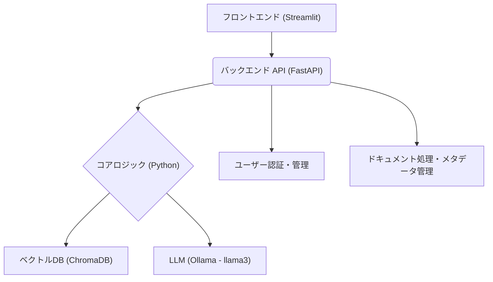

# MochiRAG プロジェクトへようこそ

MochiRAGは、個人のドキュメントに基づいてAIと対話できる、Retrieval-Augmented Generation (RAG) システムです。ユーザーは自身のドキュメントをアップロードし、それらの情報源に基づいた正確な回答をAIから得ることができます。

## 1. プロジェクト概要

MochiRAGは、エンタープライズ環境での利用も想定し、各ユーザーのドキュメントを安全に管理し、他のユーザーの情報と混在しないようにデータ分離を重視して設計されています。信頼性の高い情報源からの回答生成を目指します。

主な機能：
*   **ユーザー認証**: 安全なユーザー登録とログイン機能。
*   **ドキュメント管理**: ユーザーによるドキュメント（TXT, MD, PDF）のアップロードと管理。
*   **RAGチャット**: アップロードされたドキュメントに基づいた質問応答。複数のRAG戦略（基本、Parent Document、Multi-Query、Contextual Compression）を選択可能。
*   **データ分離**: 各ユーザーのデータは独立して扱われます。

## 2. アーキテクチャ概要

MochiRAGは、フロントエンド、バックエンドAPI、コアロジック（ドキュメント処理、ベクトルストア、RAGパイプライン）の主要コンポーネントで構成されています。



### 技術スタック
*   **バックエンド**: FastAPI (Python)
*   **フロントエンド**: Streamlit (Python)
*   **RAG・LLM連携**: LangChain (Python)
*   **LLM**: Ollama (ローカル環境、`llama3` モデルを想定)
*   **ベクトルデータベース**: ChromaDB (Python, 永続化)
*   **エンベディングモデル**: Sentence Transformers (`all-MiniLM-L6-v2`)
*   **認証**: FastAPI OAuth2/JWT (Passlib, python-jose)

## 3. 機能一覧

*   **ユーザー認証**:
    *   メールアドレスとパスワードによるユーザー登録。
    *   JWTベースのトークン認証によるログイン。
    *   パスワードはハッシュ化して保存。
*   **ドキュメント管理**:
    *   TXT, MD, PDF形式のファイルアップロード。
    *   アップロードされたドキュメントのメタデータ管理（ファイル名、日時など）。
    *   ユーザーごとのドキュメント一覧表示。
*   **RAGチャット機能**:
    *   アップロードされたドキュメント群に対する自然言語での質問応答。
    *   **RAG戦略選択**: ユーザーはチャット時に以下のRAG戦略を選択できます。
        *   `basic`: 標準的なベクトル検索とプロンプトによる応答生成。
        *   `parent_document`: 関連性の高いチャンクの親ドキュメント全体をコンテキストとして利用（注: 現在の実装では `basic` と同様の動作）。
        *   `multi_query`: 質問を複数の異なるクエリに分解し、検索結果を統合して利用。
        *   `contextual_compression`: 検索されたドキュメントから、質問に関連する部分のみを抽出して利用。
    *   必要に応じて、検索対象のデータソース（ドキュメント）を指定可能。
    *   LangChainを利用したRAGパイプライン（選択された戦略に応じた検索→プロンプト拡張→LLM応答生成）。
    *   （将来的には）回答生成時に引用元ドキュメントの情報を提示。
*   **データ分離・セキュリティ**:
    *   ユーザーごとにドキュメントとベクトルデータを分離。
    *   認証されたユーザーは自身のデータにのみアクセス可能。

## 4. セットアップと実行方法

### 前提条件
*   Python 3.10 以上
*   Ollamaがローカル環境で実行されており、`llama3` モデルがプルされていること (`ollama pull llama3`)。
    *   *注意: Ollamaが利用できない場合でも、大半の機能（認証、ドキュメント処理、ベクトル化）は動作しますが、チャット応答生成はエラーメッセージを返します。*

### インストール

#### 自動セットアップ (Linux/macOS 推奨)

プロジェクトルートにあるスクリプトを実行することで、仮想環境の作成と依存関係のインストールを自動で行えます。

1.  **リポジトリのクローン**:
    ```bash
    git clone <リポジトリURL>
    cd MochiRAG
    ```

2.  **セットアップスクリプトの実行**:
    ```bash
    chmod +x setup_dev.sh
    ./setup_dev.sh
    ```

3.  **仮想環境の有効化**:
    ```bash
    source venv/bin/activate  # Linux/macOS
    ```

#### 手動セットアップ

Windowsユーザーや、手動で環境を構築したい場合は、以下の手順に従ってください。

1.  **リポジトリのクローン後、仮想環境を作成・有効化します。**
    ```bash
    # 例: uv を使う場合 (高速)
    uv venv
    source venv/bin/activate  # Linux/macOS
    # venv\Scripts\activate    # Windows
    ```

2.  **依存関係をインストールします。**
    開発に必要なすべての依存関係（テスト用パッケージを含む）をインストールします。
    ```bash
    # uv を使う場合 (推奨)
    uv pip install ".[test]"
    ```

### 設定 (必要な場合)
*   バックエンドAPIのURLは、フロントエンド (`frontend/app.py`) 内の `BACKEND_URL` 変数で設定されています (デフォルト: `http://localhost:8000`)。
*   LLMモデル名 (`llama3`) は `core/rag_chain.py` で設定されています。

### 実行
1.  **バックエンド FastAPI サーバーの起動**:
    プロジェクトルートで以下を実行します。
    ```bash
    python -m uvicorn backend.main:app --reload --port 8000
    ```
2.  **Streamlit フロントエンドの起動**:
    プロジェクトルートで以下を実行します。
    ```bash
    streamlit run frontend/app.py
    ```
    ブラウザで `http://localhost:8501` (デフォルト) を開きます。

### 実行環境構築の詳細

#### 1. Pythonバージョン
- Python 3.10 以上が必須です。`python3 --version` で確認してください。

#### 2. 推奨パッケージ管理ツール
- `uv`（超高速なPythonパッケージマネージャ）が推奨です。
  インストール例:
  ```bash
  pip install uv
  ```

#### 3. 仮想環境の作成
- Linux/macOS:
  ```bash
  uv venv
  source venv/bin/activate
  ```
- Windows:
  ```bash
  uv venv
  venv\Scripts\activate
  ```

#### 4. 依存関係のインストール
- プロジェクトルートで
  ```bash
  uv pip install ".[test]"
  ```
  `uv` がない場合は
  ```bash
  python -m venv venv
  source venv/bin/activate
  pip install --upgrade pip
  pip install ".[test]"
  ```

#### 5. フロントエンド依存
- `frontend/requirements.txt` も `pyproject.toml` でカバーされていますが、Streamlitのみ個別にインストールしたい場合は
  ```bash
  pip install -r frontend/requirements.txt
  ```

#### 6. Ollamaのセットアップ（RAG/LLM利用時のみ必須）
- [Ollama公式](https://ollama.com/) からインストールし、
  ```bash
  ollama pull llama3
  ollama serve
  ```
  でローカルサーバーを起動してください。

#### 7. トラブルシューティング
- **依存関係の競合やインストール失敗時**
  - `venv` ディレクトリを削除し、再度仮想環境を作り直してください。
- **Ollamaが動作しない場合**
  - `ollama serve` のログや `ps aux | grep ollama` でプロセス確認。
- **ポート競合**
  - FastAPI: デフォルト8000, Streamlit: 8501。競合時は `--port` オプションで変更。

## 5. ディレクトリ構造

主要なディレクトリとファイルの説明です。

```
MochiRAG/
├── backend/                    # FastAPIバックエンド関連
│   ├── auth.py                 # 認証ロジック (ユーザー作成、トークン生成など)
│   ├── main.py                 # APIエンドポイント定義
│   ├── models.py               # Pydanticモデル (リクエスト/レスポンス、DBモデル)
│   └── __init__.py
├── core/                       # 中核となるRAG処理ロジック
│   ├── document_processor.py   # ドキュメント読み込み、チャンキング
│   ├── rag_chain.py            # RAG応答生成パイプライン
│   ├── vector_store.py         # エンベディング生成、ChromaDB連携
│   └── __init__.py
├── data/                       # アプリケーションデータ (DB、アップロードなど)
│   ├── chroma_db/              # ChromaDB永続化データ (自動生成)
│   ├── datasources_meta.json   # アップロードされたドキュメントのメタデータ
│   ├── sample_docs/            # サンプルドキュメント (テスト用)
│   ├── tmp_uploads/            # 一時アップロードファイル格納用
│   └── users.json              # ユーザー情報 (簡易的な代替DB)
├── frontend/                   # Streamlitフロントエンド関連
│   ├── app.py                  # Streamlitアプリケーション本体
│   └── requirements.txt        # フロントエンド用依存関係
├── tests/                      # Pytestテストコード
│   ├── backend/                # バックエンドAPIテスト
│   │   └── test_auth.py
│   ├── core/                   # コアロジックテスト (今後追加)
│   └── __init__.py
├── docs/                       # (将来的に) 詳細なドキュメントを格納
│   └── code_explanations/      # (将来的に) 各モジュールの詳細説明
├── .gitignore
├── explanation4review.md       # レビュー担当者向けの説明ファイル
├── MochiRAG設計.md             # 初期設計ドキュメント
├── pytest.ini                  # Pytest設定ファイル
├── README.md                   # このファイル
├── requirements.txt            # プロジェクト全体の主要依存関係
└── testing_guide.md            # テスト実行ガイド
```

## 6. APIエンドポイント概要

主要なAPIエンドポイントは `backend/main.py` で定義されています。
*   `/users/`: (POST) 新規ユーザー登録
*   `/token`: (POST) ユーザートークン取得 (ログイン)
*   `/users/me`: (GET) 認証ユーザー情報取得
*   `/documents/upload/`: (POST) ドキュメントアップロード
*   `/documents/`: (GET) アップロード済みドキュメント一覧
*   `/chat/query/`: (POST) RAGチャットクエリ

詳細なAPI仕様については、FastAPIが自動生成するSwagger UI (`/docs`) やRedoc (`/redoc`)で確認可能です。（バックエンドサーバー実行中にアクセス）

## 7. テスト

テストは `pytest` を使用して行われます。テストの実行方法やフィードバックについては、[testing_guide.md](./testing_guide.md) を参照してください。
テスト駆動開発 (TDD) またはそれに近いアプローチを推奨し、主要な機能にはユニットテストや結合テストを作成します。

## 8. コード詳細説明 (プレースホルダー)

各主要モジュールの詳細な設計や実装については、以下のドキュメント（今後作成予定）を参照してください。

*   [バックエンド認証 (`backend/auth.py`) の詳細](./docs/code_explanations/backend_auth.md) (未作成)
*   [ドキュメント処理 (`core/document_processor.py`) の詳細](./docs/code_explanations/document_processor.md) (未作成)
*   [ベクトルストア (`core/vector_store.py`) の詳細](./docs/code_explanations/vector_store.md) (未作成)
*   [RAGチェーン (`core/rag_chain.py`) の詳細](./docs/code_explanations/rag_chain.md) (未作成)
*   [APIエンドポイント (`backend/main.py`) の詳細](./docs/code_explanations/backend_main.md) (未作成)
*   [フロントエンド (`frontend/app.py`) の詳細](./docs/code_explanations/frontend_app.md) (未作成)

## 9. コード拡張とコントリビューション (プレースホルダー)

開発プロセス、新機能の追加方法、コーディングスタイルなど。 (今後記述予定)

## 10. 今後の展望・ロードマップ (プレースホルダー)

計画中の機能改善や新機能。 (今後記述予定)
*   Ollama以外のLLM（Azure OpenAIなど）への対応オプションの追加
*   チャットUIでの引用元表示の強化
*   ドキュメントインジェスト処理の非同期化・バッチ処理化
*   より高度なメタデータフィルタリングと検索オプションの提供
*   管理者向け機能（ユーザー管理、システム監視など）

