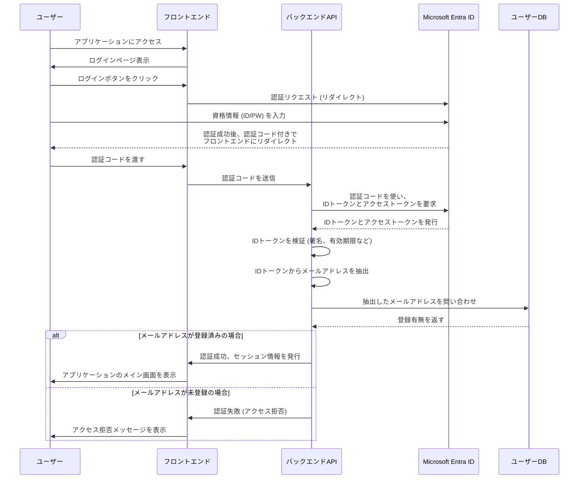

# EntraID認証と登録済みユーザーによるアクセス制御 設計書

## 1. はじめに

本ドキュメントは、Microsoft Entra ID（旧Azure Active Directory）を認証基盤として利用し、かつアプリケーションに事前登録されたメールアドレスを持つユーザーのみにアクセスを許可するシステムの設計について記述するものです。

### 1.1. 目的

*   EntraIDによるセキュアな認証を実現する。
*   認証されたユーザーの中から、許可された特定のユーザー（登録済みメールアドレスを持つユーザー）のみがアプリケーション機能を利用できるようにアクセス制御を行う。
*   将来的な拡張性を考慮した、堅牢な認証・認可の仕組みを構築する。

### 1.2. 要件

*   ユーザーはEntraIDのアカウントでアプリケーションにログインできること。
*   ログイン試行者のメールアドレスが、アプリケーションのデータベースに登録されているものと一致する場合のみ、利用を許可すること。
*   未登録のユーザーがログインしようとした場合は、アクセスが拒否され、その旨がユーザーに通知されること。

---

## 2. 認証・認可フロー

本システムは、OpenID Connect (OIDC) プロトコルに基づいた認証フローを採用します。EntraIDはOIDCプロバイダーとして機能します。



**フローの解説:**

1.  **アクセスとリダイレクト**: ユーザーがアプリにアクセスすると、フロントエンドはユーザーをEntraIDのログインページにリダイレクトします。
2.  **EntraIDでの認証**: ユーザーは使い慣れたEntraIDの画面で認証を行います。多要素認証(MFA)などもEntraID側で一元管理できます。
3.  **トークンの取得**: 認証成功後、EntraIDは**認証コード**をフロントエンド経由でバックエンドに渡します。バックエンドは、このコードを使ってEntraIDから**IDトークン**と**アクセストークン**を取得します。
4.  **IDトークンの検証とメールアドレスの取得**: バックエンドは受け取ったIDトークンの正当性を検証し、トークンに含まれるユーザー情報（`email`または`upn`クレーム）からメールアドレスを取得します。
5.  **登録ユーザー照合**: バックエンドは、取得したメールアドレスが、事前に用意されたユーザーデータベース（許可リスト）に存在するかを確認します。
6.  **アクセス許可/拒否**: データベースにメールアドレスが存在する場合にのみ、バックエンドは有効なセッションを確立し、ユーザーのアクセスを許可します。存在しない場合はアクセスを拒否します。

---

## 3. 技術要件・前提条件

### 3.1. EntraID側の設定

*   **アプリケーションの登録 (App Registration)**
    *   Azureポータルにて、本アプリケーションを新規に登録します。
    *   払い出された**クライアントID**と**テナントID**を控えます。
*   **認証設定**
    *   プラットフォームとして「Web」または「シングルページアプリケーション(SPA)」を選択します。
    *   **リダイレクトURI**を設定します（例: `https://<your-app-domain>/auth/callback`）。
*   **クライアントシークレットの発行**
    *   バックエンドがEntraIDと安全に通信するために、**クライアントシークレット**を生成し、安全な場所に保管します。
*   **APIのアクセス許可**
    *   `Microsoft Graph`の`User.Read`権限を「委任されたアクセス許可」として追加し、管理者の同意を得ます。これにより、ログインしたユーザーの基本的なプロファイル（メールアドレスを含む）を読み取ることができます。
*   **トークンの構成**
    *   IDトークンに`email`および`upn` (User Principal Name) クレームが含まれるように設定します。

### 3.2. アプリケーション側の要件

*   **認証ライブラリ**:
    *   **フロントエンド**: `MSAL.js` (@azure/msal-browser) を利用し、ログインリダイレクト処理を実装します。
    *   **バックエンド**: 各言語に対応したMSALライブラリ（例: `msal-node`, `Microsoft.Identity.Web` for .NET）を利用し、トークンの取得・検証を容易にします。
*   **ユーザーデータベース**:
    *   アクセスを許可するユーザーのメールアドレスを格納するためのテーブルをデータベースに用意します。
    *   例: `allowed_users` テーブル (カラム: `id`, `email`, `created_at`)
*   **設定情報の管理**:
    *   クライアントID、テナントID、クライアントシークレットなどの機密情報は、環境変数やAzure Key Vaultなどのセキュアな仕組みで管理します。

---

## 4. 実装の詳細（概念）

### 4.1. バックエンド (例: Node.js with Express)

**1. トークンの検証とユーザー照合を行うAPIエンドポイント**
`/api/auth/callback`

```javascript
// (概念コード)
const express = require('express');
const msal = require('@azure/msal-node');

// MSALクライアントの初期化 (設定は環境変数から読み込む)
const msalClient = new msal.ConfidentialClientApplication({ ... });

const router = express.Router();

router.post('/auth/callback', async (req, res) => {
    const { code } = req.body; // フロントエンドから認証コードを受け取る

    try {
        // 認証コードを使ってトークンを取得
        const tokenResponse = await msalClient.acquireTokenByCode({
            code: code,
            redirectUri: process.env.REDIRECT_URI,
            scopes: ["User.Read"]
        });

        // IDトークンからメールアドレスを取得
        const userEmail = tokenResponse.account.username; // UPNが使われることが多い

        // データベースでメールアドレスを検索
        const isAllowed = await db.query('SELECT * FROM allowed_users WHERE email = ?', [userEmail]);

        if (isAllowed) {
            // 許可されたユーザーの場合、セッションを作成してトークンなどを返す
            // req.session.user = { email: userEmail };
            res.status(200).json({ message: "Authentication successful." });
        } else {
            // 許可されていないユーザーの場合
            res.status(403).json({ error: "Access Denied. User is not registered." });
        }

    } catch (error) {
        console.error(error);
        res.status(500).json({ error: "Authentication failed." });
    }
});

module.exports = router;
```

### 4.2. 登録済みユーザーの管理

*   アプリケーションに管理者用画面を用意し、そこから許可するユーザーのメールアドレスをデータベースに登録・削除できる機能を設けることが推奨されます。
*   あるいは、データベースに直接レコードを追加・削除することで管理します。

---

## 5. セキュリティに関する考慮事項

*   **クライアントシークレットの保護**: バックエンドのクライアントシークレットは、Azure Key Vaultや各クラウドプロバイダーが提供するシークレット管理サービスを利用して厳重に管理します。ソースコードには絶対にハードコーディングしません。
*   **HTTPSの強制**: すべての通信はTLS/SSL（HTTPS）で暗号化します。
*   **トークンの検証**: IDトークンの署名、発行者(`iss`)、対象者(`aud`)、有効期限(`exp`)を必ず検証し、不正なトークンを拒否します。MSALライブラリがこれらの検証を自動で行います。
*   **CORS設定**: フロントエンドとバックエンドのドメインが異なる場合は、バックエンド側で適切なCORS（Cross-Origin Resource Sharing）ポリシーを設定します。

---

## 6. まとめ

本設計により、EntraIDの強力な認証機能と、アプリケーション独自のアクセス制御リスト（登録済みメールアドレス）を組み合わせることが可能になります。これにより、セキュリティを確保しつつ、特定の許可されたユーザーグループのみにサービスを提供するという要件を満たすことができます。
